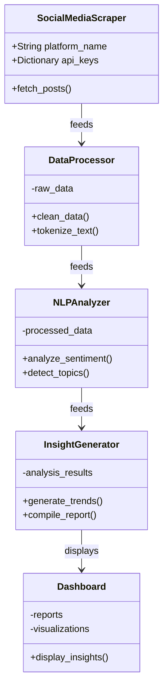
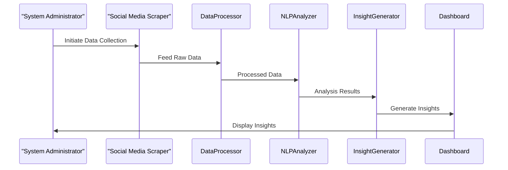

# Mental-Health-Bot
This is a bot that tracks mental health cases in social media platforms


### 1. Use Case Diagram

```mermaid
%%{init: {'theme': 'default'}}%%
usecaseDiagram
  actor SocialMediaUser as "Social Media User"
  actor SystemAdmin as "System Administrator"
  actor HealthcareProfessional as "Healthcare Professional"
  actor GeneralPublic as "General Public/User"
  rectangle System {
    SocialMediaUser --> (Collect Data)
    SystemAdmin --> (Configure Bot)
    (Generate Insights) .> (View Insights) : <<include>>
    (Analyze Data) .> (Generate Insights) : <<include>>
    (Process Data) .> (Analyze Data) : <<include>>
    (Collect Data) .> (Process Data) : <<include>>
    HealthcareProfessional --> (View Insights)
    GeneralPublic --> (View Insights)
  }
```

### 2. Class Diagram



### 3. Sequence Diagram



### 4. Component Diagram

```mermaid
%%{init: {'theme': 'default'}}%%
componentDiagram
  package "Data Collection Component" {
    [Social Media APIs]
    [Scraping Services]
  }
  package "Data Processing Component" {
    [Text Cleaning]
    [Normalization]
  }
  package "NLP Analysis Component" {
    [Sentiment Analysis]
    [Topic Detection]
  }
  package "Insight Generation Component" {
    [Trend Aggregation]
    [Report Generation]
  }
  package "User Interface Component" {
    [Web Dashboard]
  }

  [Social Media APIs] ..> [Text Cleaning] : Data Flow
  [Scraping Services] ..> [Text Cleaning] : Data Flow
  [Text Cleaning] ..> [Normalization] : Data Flow
  [Normalization] ..> [Sentiment Analysis] : Data Flow
  [Sentiment Analysis] ..> [Trend Aggregation] : Data Flow
  [Topic Detection] ..> [Trend Aggregation] : Data Flow
  [Trend Aggregation] ..> [Web Dashboard] : Data Flow
```
