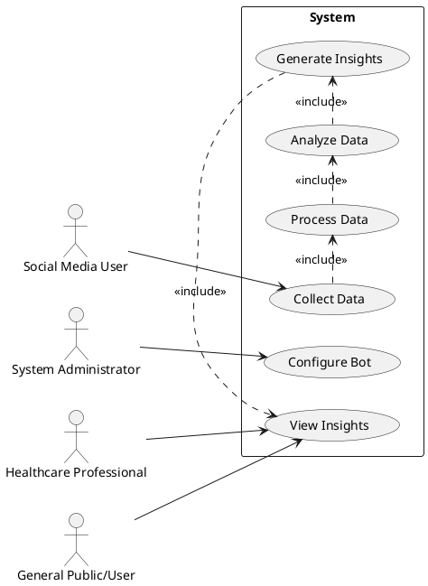
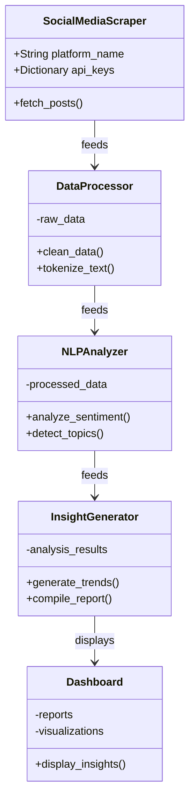
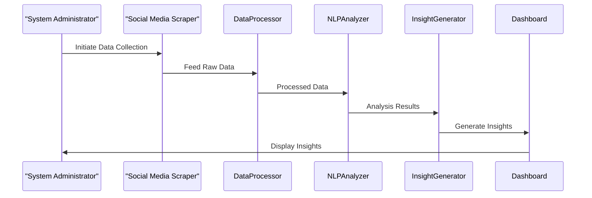

# Mental-Health-Bot
This is a bot that tracks mental health cases in social media platforms


### 1. Use Case Diagram



This diagram represents the following use cases and their interactions:
- **Collect Data**: Social media users create content that the system collects.
- **Configure Bot**: The system administrator configures and manages the bot.
- **Generate Insights**: The bot analyzes the collected data to generate insights.
- **View Insights**: Healthcare professionals and the general public can view the generated insights.
- **Analyze Data**: The bot processes the data to analyze it.
- **Process Data**: The bot preprocesses the collected data for analysis.

### 2. Class Diagram



### 3. Sequence Diagram



### 4. Component Diagram

```mermaid
%%{init: {'theme': 'default'}}%%
componentDiagram
  package "Data Collection Component" {
    [Social Media APIs]
    [Scraping Services]
  }
  package "Data Processing Component" {
    [Text Cleaning]
    [Normalization]
  }
  package "NLP Analysis Component" {
    [Sentiment Analysis]
    [Topic Detection]
  }
  package "Insight Generation Component" {
    [Trend Aggregation]
    [Report Generation]
  }
  package "User Interface Component" {
    [Web Dashboard]
  }

  [Social Media APIs] ..> [Text Cleaning] : Data Flow
  [Scraping Services] ..> [Text Cleaning] : Data Flow
  [Text Cleaning] ..> [Normalization] : Data Flow
  [Normalization] ..> [Sentiment Analysis] : Data Flow
  [Sentiment Analysis] ..> [Trend Aggregation] : Data Flow
  [Topic Detection] ..> [Trend Aggregation] : Data Flow
  [Trend Aggregation] ..> [Web Dashboard] : Data Flow
```
